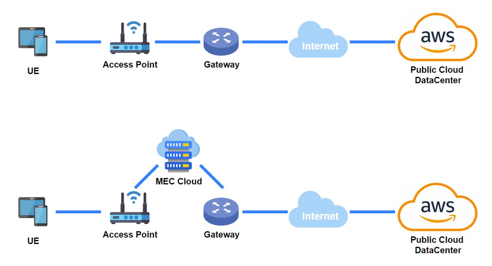
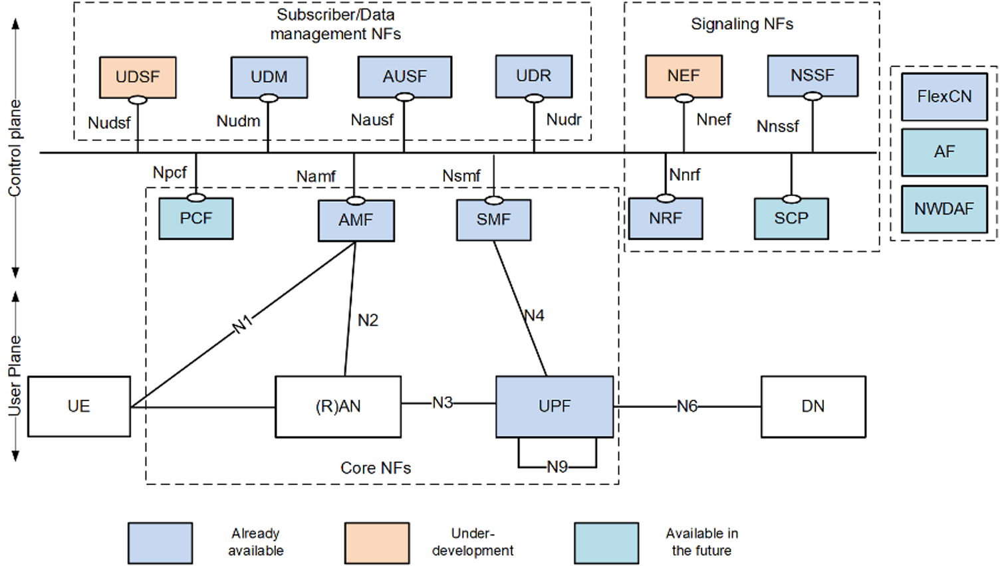
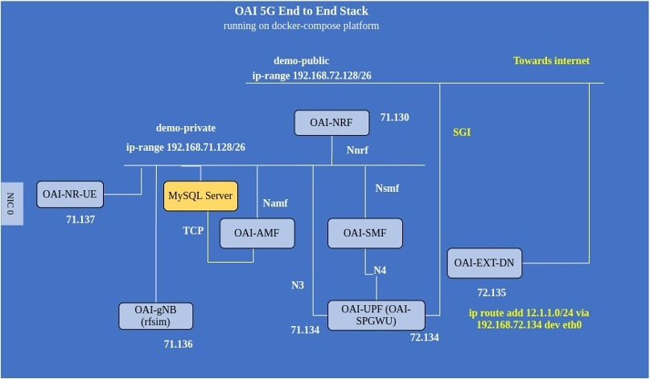
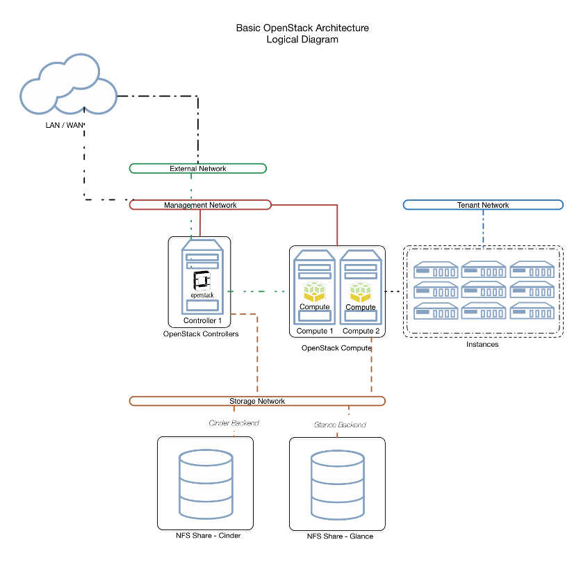

---
title: My page
type: landing

sections:
  - block: markdown
    content:
      title: "5G TestBed Construction  Based on OpenAirInterface"
      subtitle: MEC
      text: |
        # Efficient Data Processing  with MEC in 5G Networks
        

          
        

           

        ## Project Introduction
        - Research on processing large-scale data provided by AWS using Multi-access Edge Computing (MEC) with OpenAirInterface (OAI) and USRP devices
        - Development and validation of solutions for handling large-scale traffic in 5G networks
        - Real-time analysis and processing of AWS-based service data, research on latency optimization

          

        ## 1. Technology Stack
        1. **Network Infrastructure**
           - OpenAirInterface (OAI)
           - USRP (Universal Software Radio Peripheral)
           - Private Cloud Infrastructure

            

        2. **Cloud and Development Environment**
           - OpenStack (Kolla-Ansible)
           - AWS EC2
           - Kubernetes

            

        3. **Data Processing**
           - Python
           - Kubernetes
           - Ansible

            

        4. **CI/CD**
           - Jenkins
           - GitLab
           - Harbor

            

        5. **Monitoring**
           - Prometheus
           - Grafana
           - ONOS          

              

        ## 2. Project Duration and Schedule Management
        Project Duration
           - March 2, 2024 ~ 

              

        ## 3. Project Differentiators
        - **Low-latency** real-time data processing using **OAI and MEC** for AWS data
        - Providing **network scalability** capable of handling large-scale traffic in a Private Cloud environment
        - Improved traffic processing efficiency through **ML-based optimization** algorithms

           

        ## 4. OpenAirInterface5G Architecture
        

          
        

           

        ## 5. Point Use Stack
        

          
        

           

        ## 6. OpenStack
        

          
        

           

---