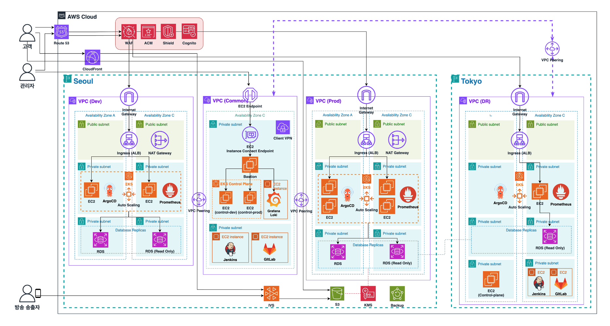

---
title: My page
type: landing

sections:
  - block: markdown
    content:
      title: '**Large-scale Traffic Handling  Live Streaming Infrastructure Development**'
      subtitle: AWS 
      text: |
        # OliveYoung Live Commerce 
        

          
        

        - Access URL: https://www.olcl.shop
        - Test ID: user1 / CloudWave!

        
           
         
        ## Project Introduction
        - **Multi-channel** live service providing 3 or more live channels
        - **Stable** live service through cloud-based traffic handling
        - Personalized service utilizing **AWS SaaS** based ML services

          

        ## 1. Technology Stack
        1. **Infrastructure**
           - Nginx
           - Kubernetes
           - EC2

            

        2. **Development**
           - Streamlit
           - SpringBoot
           - Lambda

            

        3. **Database**
           - RDS
           - DynamoDB
           - S3

            

        4. **CI/CD**
           - GitLab
           - Jenkins
           - ArgoCD

            

        5. **Monitoring**
           - Loki
           - Prometheus
           - Grafana
           - CloudWatch

            

        6. **Collaboration**
           - Notion
           - Slack

              

        ## 2. Project Duration and Schedule Management
        Project Duration
           - August 12, 2024 ~ August 31, 2024

            

        Schedule Management
           - Sharing progress through Notion and Slack
           - Daily morning meetings and Agile task distribution

              

        ## 3. Project Differentiators
        - Central management environment for separation and isolation of development and operational environments
        - Warm Standby DR (RTO: 5min / RPO: 15min)
        - No Public Bastion → Using EC2 Instance Connect Endpoint
        - Closed CI/CD implementation
        - Shared resources between environments
        - Cost reduction to 1/25 level using thumbnails for Rekognize

           

        ## 4. Overall Architecture
        

          
        

           

        ## 5. IVS - Service Flow
        

          
        

           

        ## 6. Rekognition + Personalize - Service Flow
        

          
        

           

        ## 7. Monitoring
        

          
        

        - Prometheus + Loki & CloudWatch

           

        ## 8. Alarm
        

          
        

           

        ## 9-1. CI/CD Pipeline
        

          
        

           

        ## 9-2. Lambda Pipeline
        

          
        

           

        ## 10. Load Test
        

          
        

        - 100,000 requests/s Test using ApacheBench & JMeter

           

        ## 11. Improvement Goals
        1. Monitoring Optimization
              - Transition from single Prometheus-based centralized monitoring → Metric management using Thanos (OSS)

               

        2. Performance Enhancement through Cache Usage
              - RDS - Elastic Cache connection → Improving database access performance

               

        3. Advanced Log Analysis
              - Using ELK stack (Elasticsearch - Logstash - Kibana) → Strengthening problem response capabilities 
---