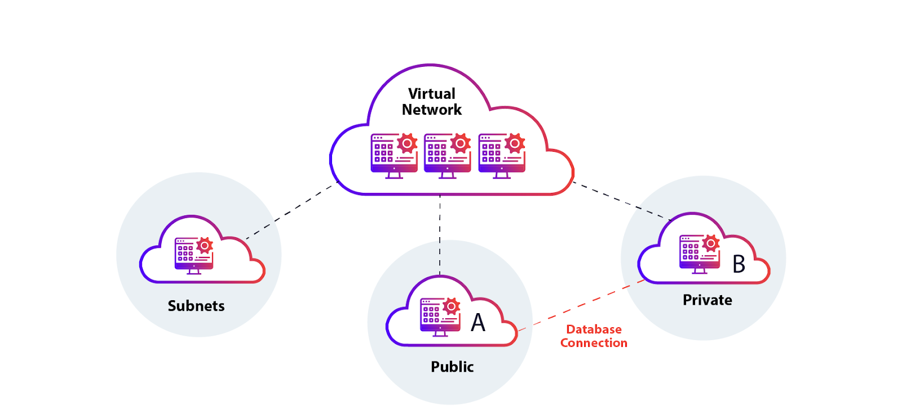

---
title: My page
type: landing

sections:
  - block: markdown
    content:
      title: '**Network Virtualization**'
      text: |
        # NFV & MEC

  - block: slider
    content:
      slides:
        - title: Network Function Virtualization
          content: NFV
          align: center
          background:
            image:
              filename: NFV(unsplash).jpg
            brightness: 0.4
            position: center
            color: '#000'
        - title: Software-Defined Networking
          content: SDN
          align: center
          background:
            image:
              filename: SDN(unsplash).jpg
            brightness: 0.4
            position: center
            color: '#000'
        - title: Virtual Network Functions
          content: VNF
          align: center
          background:
            image:
              filename: VNF(unsplash).jpg
            brightness: 0.4
            position: center
            color: '#000'
        - title: Multi-access Edge Computing
          content: MEC / Cloud
          align: center
          background:
            image:
              filename: cloud(unsplash).jpg
            brightness: 0.4
            position: center
            color: '#000'
    design:
      slide_height: '500px'
      is_fullscreen: false
      loop: true
      interval: 3000

  - block: markdown
    content:
      title: ''
      subtitle: ''
      text: |
        ## Introduction
        

        Network virtualization and Multi-access Edge Computing (MEC) are key elements of modern network infrastructure, enabling more flexible, efficient, and intelligent network construction.
        

        - **Network Virtualization**: Abstracting physical network resources into software
        - **MEC**: Providing computing capabilities at the network edge to reduce latency and improve performance

          

        ## 1. Core Concepts
        1. **Network Virtualization**
          - NFV (Network Function Virtualization)
          - SDN (Software-Defined Networking)
          - VNF (Virtual Network Functions)

           

        2. **Multi-access Edge Computing**
          - Edge Data Centers
          - Low-latency Applications

         

        3. **Related Technologies**
          - 5G and Beyond 5G Networks
          - Network Slicing
          - Cloud-Native Networking

           

        ## 2. Technological Necessity
        1. **Enhanced Flexibility**
          - Dynamic Resource Allocation
          - Reduced Service Deployment Time

           

        2. **Cost Efficiency**
          - Reduction in CAPEX and OPEX
          - Decreased Hardware Dependency

           

        3. **Performance Optimization**
          - Latency Reduction
          - Efficient Bandwidth Utilization

           

        4. **Accelerated Innovation**
          - Rapid Launch of New Services
          - Customized Network Services

           

        ## 3. Application Areas
        - **Smart Cities**: Real-time Traffic Management, Energy Grid Optimization
        - **Industrial Automation**: Smart Factories, Predictive Maintenance
        - **Augmented/Virtual Reality**: Immersive Gaming, Remote Collaboration
        - **Autonomous Driving**: Vehicle-to-Vehicle Communication, Real-time Route Optimization
        - **Healthcare**: Telemedicine, Real-time Patient Monitoring

           

        ## 4. Technical Architecture
        

          
        

           

        ## 5. Key Technology Trends
        1. **AI/ML Integration**: Network Automation and Optimization
        2. **Edge AI**: Distributed Learning and Inference
        3. **Quantum Networking**: Ultra-high Speed, Ultra-secure Communication
        4. **Green Networking**: Energy-efficient Network Design

           

        ## 6. Challenges
        - **Security and Privacy**: Data Protection in Distributed Environments
        - **Standardization**: Interoperability Among Various Vendors and Technologies
        - **Complexity Management**: Efficient Operation and Management of Distributed Systems
        - **Skill Gap**: Training Specialized Personnel for New Technologies

           

        ## 7. Learning Resources
        1. **Technical Documents**
          - ETSI MEC White Paper
          - ONF (Open Networking Foundation) SDN Architecture

        2. **Conferences and Workshops**
          - MEC World Congress
          - Open Networking Summit

        3. **Open Source Projects**
          - ONAP (Open Network Automation Platform)
          - Open Edge Computing Initiative

           

        ## 8. Future Outlook
        - Integration with 6G Networks
        - Development as a Key Technology for Space Internet Construction
        - Fusion with Quantum Computing for Ultra-fast, Ultra-secure Networks

           

        

        "Network virtualization and MEC are more than just technologies. They represent a revolutionary paradigm that can fundamentally change how we interact with the world. A deep understanding of these fields will be crucial for future network innovation."
        

---