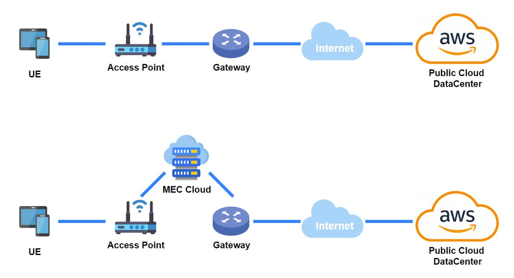
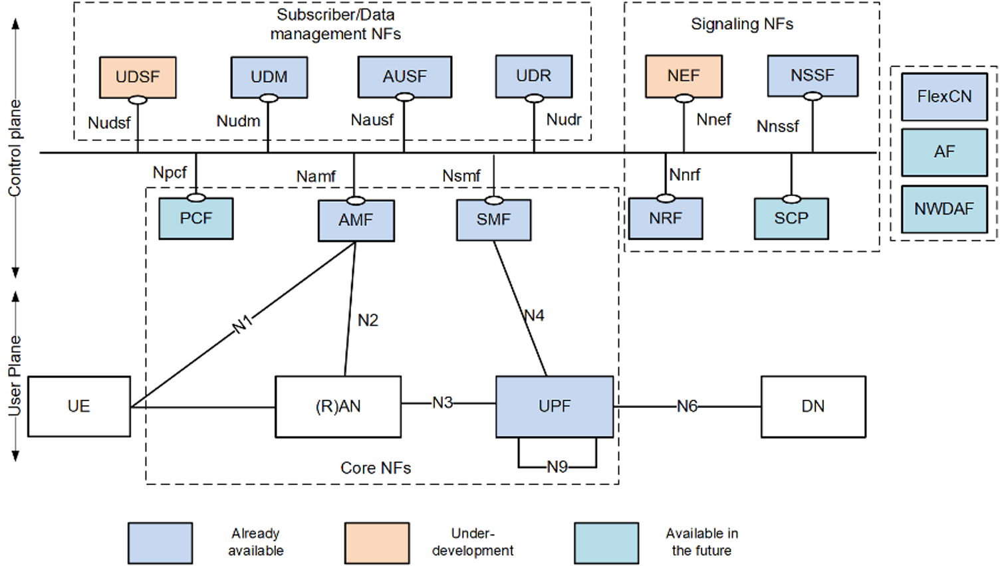
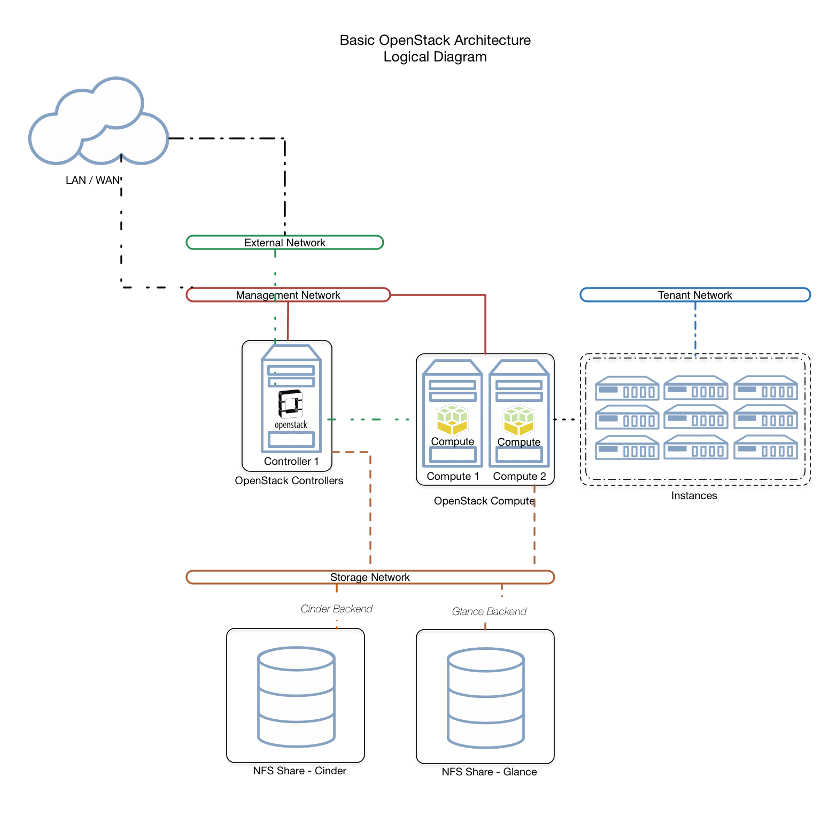

---
title: My page
type: landing

sections:
  - block: markdown
    content:
      title: "OpenAirInterface 기반  5G TestBed 구축"
      subtitle: MEC
      text: |
        # Efficient Data Processing  with MEC in 5G Networks
        

           

        ## 프로젝트 소개
        - OpenAirInterface(OAI)와 USRP 장치를 이용하여 AWS에서 제공되는 대규모 데이터를 Multi-access Edge Computing(MEC)에서 처리하는 연구
        - 5G 네트워크에서 대규모 트래픽을 처리하는 솔루션 개발 및 검증
        - AWS 기반 서비스 데이터를 실시간으로 분석 및 처리, Latency 최적화 연구

          

        ## 1. 기술 스택
        1. **네트워크 인프라**
           - OpenAirInterface (OAI)
           - USRP (Universal Software Radio Peripheral)
           - Private Cloud Infrastructure

            

        2. **클라우드 및 개발 환경**
           - OpenStack (Kolla-Ansible)
           - AWS EC2
           - Kubernetes

            

        3. **데이터 처리**
           - Python
           - Kubernetes
           - Ansible

            

        4. **CI/CD**
           - Jenkins
           - GitLab
           - Harbor

            

        5. **모니터링**
           - Prometheus
           - Grafana
           - ONOS          

              

        ## 2. 프로젝트 기간 및 일정 관리
        프로젝트 기간
           - 2024-03-02 ~ 

              

        ## 3. 프로젝트 차별점
        - AWS 데이터를 **OAI 및 MEC** 를 사용하여 **저지연** 실시간 데이터 처리
        - Private Cloud 환경에서 대규모 트래픽에 대응 가능한 **네트워크 확장성** 제공
        - **ML 기반 최적화** 알고리즘을 통한 트래픽 처리 효율 향상

           

        ## 4. OpenAirInterface5G Architecture
        

           

        ## 5. Point Use Stack
        

           

        ## 6. OpenStack
        

           

---