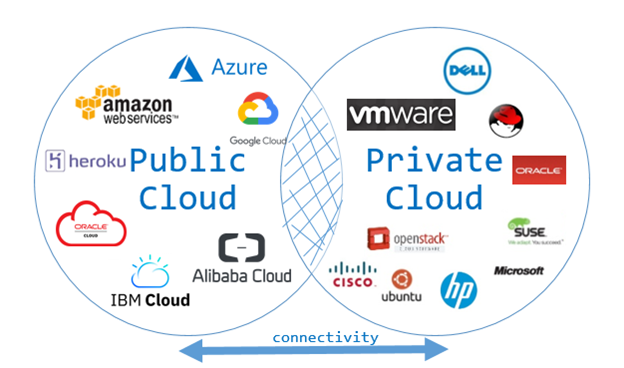
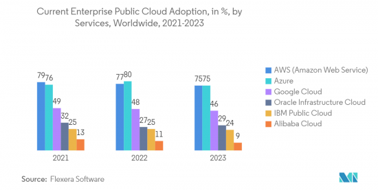

---
title: My page
type: landing

sections:
  - block: markdown
    content:
      title: '**클라우드 컴퓨팅**'
      subtitle: ''
      text: |
        

          
        

        ## 소개
        클라우드 컴퓨팅은 인터넷을 통해 컴퓨팅 리소스를 제공하는 기술로, 기업과 개인에게 유연하고 확장 가능한 IT 인프라를 제공합니다.

        - **클라우드 컴퓨팅**: 네트워크를 통해 컴퓨팅 리소스를 서비스로 제공
        - **분산 컴퓨팅**: 여러 컴퓨터에 작업을 분산하여 처리하는 기술

          

        ## 1. 핵심 개념
        1. **서비스 모델**
          - IaaS (Infrastructure as a Service)
          - PaaS (Platform as a Service)
          - SaaS (Software as a Service)

           

        2. **배포 모델**
          - 퍼블릭 클라우드
          - 프라이빗 클라우드
          - 하이브리드 클라우드

         

        3. **관련 기술**
          - 가상화
          - 컨테이너화
          - 마이크로서비스 아키텍처

           

        ## 2. 기술 필요성
        1. **비용 효율성**
          - 초기 투자 비용 감소
          - 사용량 기반 과금 모델

           

        2. **확장성**
          - 수요에 따른 자동 확장
          - 글로벌 인프라 활용

           

        3. **유연성**
          - 다양한 서비스 선택
          - 신속한 리소스 프로비저닝

           

        4. **혁신 가속화**
          - 최신 기술 접근성 향상
          - 빠른 서비스 출시

           

        ## 3. 적용 분야
        - **기업 IT**: 기업 애플리케이션 호스팅, 데이터 분석
        - **스타트업**: 빠른 서비스 출시, 확장 가능한 인프라
        - **IoT**: 대규모 데이터 처리, 디바이스 관리
        - **AI/ML**: 대규모 컴퓨팅 리소스 제공, 모델 학습 및 추론
        - **미디어 스트리밍**: 콘텐츠 전송 네트워크, 실시간 스트리밍

           

        ## 4. 퍼블릭 클라우드 점유율 현황
        

          
        

           

        ## 5. 주요 기술 동향
        1. **엣지 컴퓨팅**: 데이터 처리의 분산화
        2. **서버리스 컴퓨팅**: 인프라 관리 추상화
        3. **멀티 클라우드**: 여러 클라우드 서비스 통합 사용
        4. **AI/ML 통합**: 클라우드 기반 AI 서비스 제공

           

        ## 6. 도전 과제
        - **보안 및 규정 준수**: 데이터 보안, 개인정보 보호
        - **벤더 종속성**: 특정 클라우드 제공업체 의존도
        - **복잡성 관리**: 분산 시스템의 효율적 운영
        - **비용 최적화**: 클라우드 리소스 사용 효율화

           

        ## 7. 학습 리소스
        1. **기술 문서**
          - AWS, Azure, GCP 공식 문서
          - NIST 클라우드 컴퓨팅 표준

        2. **컨퍼런스 및 워크샵**
          - AWS re:Invent
          - Google Cloud Next

        3. **오픈소스 프로젝트**
          - Kubernetes
          - OpenStack

           

        ## 8. 미래 전망
        - 엣지-클라우드 통합 아키텍처 발전
        - 양자 컴퓨팅과 클라우드의 융합
        - 지속 가능한 그린 클라우드 기술 발전

           

        

        "클라우드 컴퓨팅은 현대 IT 인프라의 근간이 되었습니다. 이는 기업의 디지털 혁신을 가속화하고, 새로운 비즈니스 모델을 가능케 하는 핵심 기술입니다. 클라우드에 대한 깊이 있는 이해는 미래 IT 산업의 발전 방향을 예측하고 선도하는 데 필수적입니다."
        

---