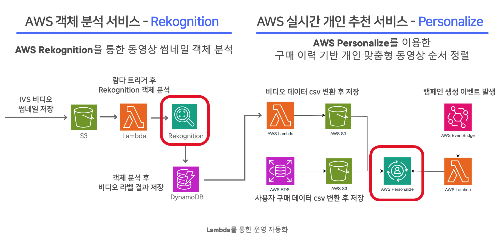
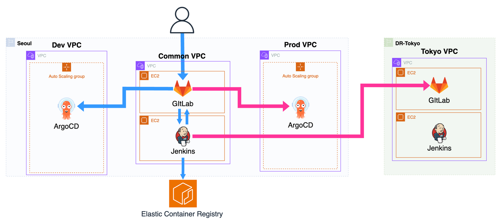

---
title: My page
type: landing

sections:
  - block: markdown
    content:
      title: "대규모 트래픽 대응  라이브 스트리밍 인프라 구축"
      subtitle: AWS
      text: |
        # OliveYoung Live Commerce 
        
        - 접속 URL : https://www.olcl.shop
        - Test ID : user1 / CloudWave!
        
           

        ## 프로젝트 소개
        - 3개 이상의 라이브 채널을 제공하는 **다중** 채널 라이브 서비스
        - 클라우드 기반의 트래픽 처리를 통한 **안정적인** 라이브 서비스
        - **AWS SaaS** 기반 ML 서비스 활용을 통한 개인 맞춤형 서비스

          

        ## 1. 기술 스택
        1. **인프라**
           - Nginx
           - Kubernetes
           - EC2

            

        2. **개발**
           - Streamlit
           - SpringBoot
           - Lambda

            

        3. **데이터 베이스**
           - RDS
           - DynamoDB
           - S3

            

        4. **CI/CD**
           - GitLab
           - Jenkins
           - ArgoCD

            

        5. **모니터링**
           - Loki
           - Prometheus
           - Grafana
           - CloudWatch

            

        6. **협업**
           - Notion
           - Slack

              

        ## 2. 프로젝트 기간 및 일정 관리
        프로젝트 기간
           - 2024-08-12 ~ 2024-08-31

            

        일정 관리
           - Notion 및 Slack을 통해 진행 상황 공유
           - 매일 오전 회의 진행 및 Agile한 업무 분담

              

        ## 3. 프로젝트 차별점
        - 개발 환경과 운영 환경 분리 및 격리를 위한 중앙 관리 환경 존재
        - Warm Standby DR (RTO : 5min / RPO : 15min)
        - Public Bastion X → EC2 Instance Connect Endpoint 사용
        - 폐쇄 CI/CD 구축
        - 환경 간 중복 리소스 공유
        - 썸네일을 사용한 Rekognize로 1/25 수준 비용 절감

        ## 4. 전체 아키텍처
        

           

        ## 5. IVS - Service Flow
        

           

        ## 6. Rekognition + Personalize - Service Flow
        

           

        ## 7. Monitoring
        
        - Prometheus + Loki & Cloudwatch

           

        ## 8. Alarm
        

           

        ## 9-1. CI/CD Pipeline
        

           

        ## 9-2. Lambda Pipeline
        

           

        ## 10. Load Test
        
        - ApacheBench & Jmeter 를 통한 100,000 request/s Test

           

        ## 11. 개선 목표
        1. Monitoring 최적화
              - 단일 Prometheus기반 중앙 집중식 모니터링 → Thanos(OSS)를 활용한 메트릭 관리

               

        2. Cache 사용을 통한 성능 향상
              - RDS - Elastic Cache 연결 → 데이터 베이스 접근 성능 향상

               

        3. Log에 대한 분석 고도화
              - ELK stack (Elasticsearch - Logstash - Kibana) 사용 → 문제 대응력 강화 
---